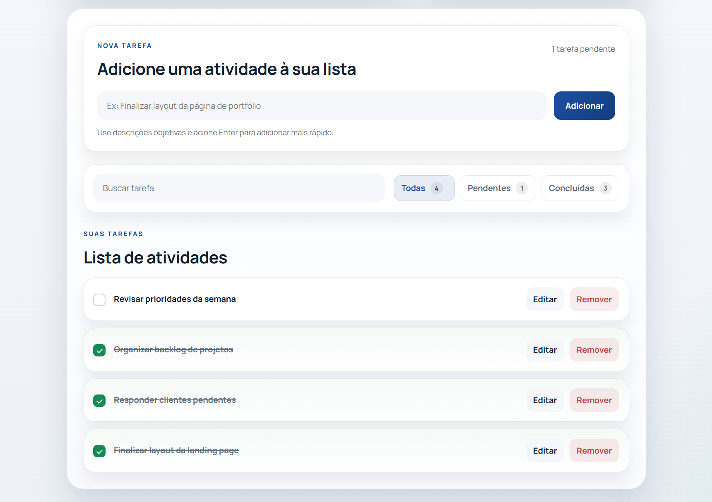
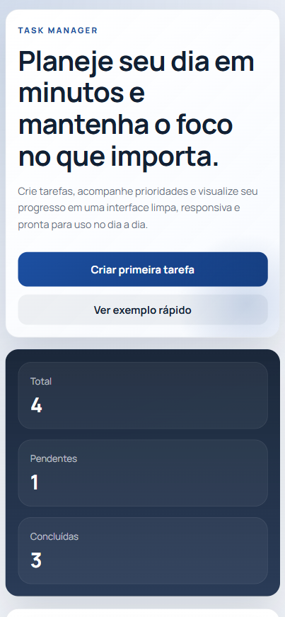
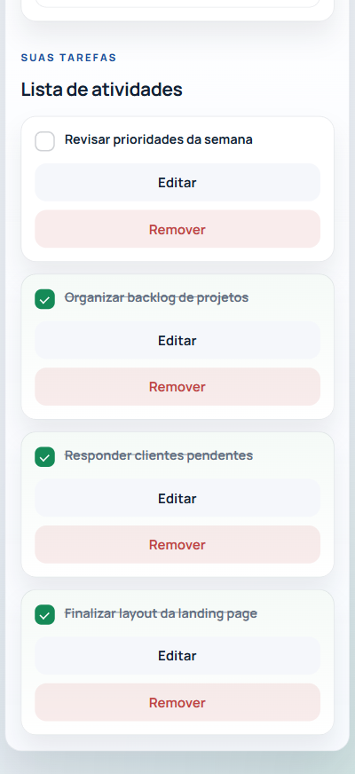

# 🧠 Task Manager — Aplicação Web de Produtividade

Aplicação web moderna para gerenciamento de tarefas, desenvolvida com foco em organização, produtividade e experiência do usuário. Permite criar, editar, concluir, filtrar e buscar tarefas de forma rápida e intuitiva.

---

## 🚀 Demo

🔗 [Acesse o projeto online](https://task-manager-ten-liard.vercel.app/)

---

## 💼 Contexto do projeto

Este projeto foi desenvolvido como uma aplicação prática que simula um sistema real de gerenciamento de tarefas, com foco em usabilidade, responsividade e persistência de dados no navegador.

A proposta foi criar uma interface limpa e funcional que ajude o usuário a organizar suas atividades diárias de forma eficiente.

---

## 📸 Preview

### 🖥️ Desktop

#### 🏠 Interface principal


#### 📋 Lista de tarefas


### 📱 Mobile

#### 🏠 Interface principal



#### 📋 Lista de tarefas



---

## ⚙️ Tecnologias utilizadas

- HTML5 (estrutura semântica)
- CSS3 (Flexbox, Grid, responsividade)
- JavaScript (Vanilla)
- LocalStorage (persistência de dados)
- Vercel (deploy)

---

## ✨ Funcionalidades

- Criar tarefas
- Editar tarefas
- Remover tarefas
- Marcar como concluída
- Buscar tarefas em tempo real
- Filtrar por status: todas, pendentes e concluídas
- Contador de tarefas: total, pendentes e concluídas
- Persistência de dados com LocalStorage
- Layout responsivo
- Feedback visual com notificações toast
- Tarefa de exemplo para onboarding do usuário

---

## 🎯 Objetivos do projeto

- Desenvolver uma aplicação funcional com JavaScript puro
- Simular um sistema real de produtividade
- Trabalhar manipulação de DOM e gerenciamento de estado
- Aplicar boas práticas de organização de código
- Criar uma interface moderna e responsiva

---

## 🧩 Destaques técnicos

- Gerenciamento de estado centralizado (`state`)
- Normalização de dados para evitar inconsistências
- Uso de `localStorage` com tratamento de erros
- Renderização dinâmica com template HTML (`<template>`)
- Delegação de eventos para melhor performance
- Separação clara entre lógica, interface e dados
- Interface com foco em acessibilidade (`aria-*`)

---

## 📂 Estrutura do projeto

```text
task-manager/
├── index.html
├── style.css
├── script.js
└── images/
    ├── preview-desktop.png
    ├── preview-desktop-tasks.png
    ├── preview-mobile.png
    └── preview-mobile-tasks.png
```

---

## 📂 Como rodar o projeto localmente

```bash
git clone https://github.com/tiagoibernon/task-manager.git
cd task-manager
```

Depois, abra o arquivo `index.html` no navegador.

---

## 👨‍💻 Autor

Desenvolvido por **Tiago Ibernon**

- [GitHub](https://github.com/tiagoibernon)
- [LinkedIn](https://www.linkedin.com/in/ibernontiago/)

---

## 📌 Status do projeto

**Status:** Finalizado e publicado.

---

## 🔄 Melhorias futuras

- Integração com backend/API
- Autenticação de usuário
- Sincronização entre dispositivos
- Ordenação por data ou prioridade
- Drag and drop de tarefas
- Dark mode
- Melhorias de acessibilidade
